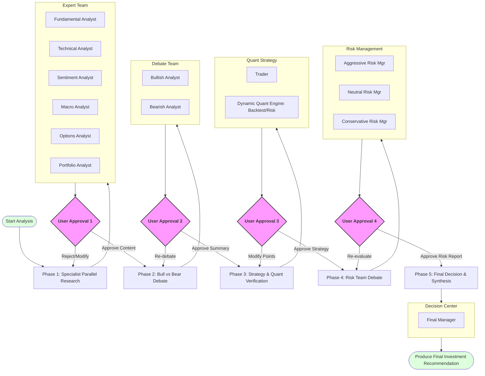

# Multi-Agent Trading Analysis (HITL Workflow)

[English](README.md) | [繁體中文](README.zh-TW.md)

## Project Overview
This project is a professional-grade stock analysis system based on Claude Code, featuring a Multi-Agent System (MAS) architecture with a comprehensive Human-in-the-Loop (HITL) mechanism. The system is **Zero-Code Driven**, meaning all quantitative logic is handled dynamically by agents without pre-written scripts. It simulates the operational workflow of a professional investment firm, from multi-asset portfolio research and specialist analysis to bull/bear debates and advanced risk engine simulations (VaR/Monte Carlo).

## The Flow (Core Workflow)

The core feature of this system is **"User-led Content Filtering and Process Control."** Outputs from every stage must be reviewed and confirmed by the user.

### 1. Phase 1: Specialist Research
*   **Data Acquisition**: Automatically calls Yahoo Finance MCP tools to fetch financials, news, price history, and options chains.
*   **Parallel Research**:
    *   **Fundamental Analyst**: Financial health and valuation.
    *   **Technical Analyst**: Price action and indicators.
    *   **Sentiment Analyst**: News and market mood.
    *   **Macro Analyst**: Global economic context.
    *   **Options Analyst**: Implied volatility and market expectations via options.
    *   **Portfolio Analyst**: Correlation analysis and asset allocation optimization.
*   **User Approval Point**: User reviews the six reports and decides which content to adopt.

### 2. Phase 2: Bull vs Bear Debate
*   **Constrained Environment**: Agents debate strictly based on Phase 1 approved content.
*   **User Approval Point**: User filters valid points and decides if further rounds are needed.

### 3. Phase 3: Strategy & Quant Verification (Zero-Code)
*   **Trader Formulation**: Strategy with specific Entry/Exit/SL targets.
*   **Dynamic Quant Engine**: Real-time execution of:
    *   **Backtesting**: Performance including slippage and commissions.
    *   **Risk Engine**: 99% VaR/CVaR and 10,000-path Monte Carlo simulations.
*   **User Approval Point**: User reviews strategy alongside quantitative validation data.

### 4. Phase 4: Risk Management Team Debate
*   **Arbitration**: ARM, NRM, and CRM agents debate based on the quantitative risk data (VaR, PoP).
*   **User Approval Point**: User reviews the risk-adjusted perspectives.

### 5. Phase 5: Final Decision & Synthesis
*   **Automated Decision**: `Final Manager` integrates all approved historical records for the final judgment.
*   **Report Generation**: Produces a professional Investment Memorandum.

## Zero-Code Architecture
This project maintains **no permanent Python script files**. All logic is defined in Markdown agents and skills. Computations are performed via dynamic on-the-fly script execution by agents using the underlying environment, ensuring a pure prompt-driven experience.

## Agent Roles at a Glance

| Agent Name | Core Responsibility |
| :--- | :--- |
| **Fundamental Analyst** | Financials and valuation. |
| **Technical Analyst** | Trends and support/resistance. |
| **Sentiment Analyst** | Market narrative and news. |
| **Macro Analyst** | Interest rates and macro catalysts. |
| **Options Analyst** | IV, Skew, and Option Walls. |
| **Portfolio Analyst** | Correlations and Weight Optimization. |
| **Bullish Analyst** | Bullish logic and catalysts. |
| **Bearish Analyst** | Bearish logic and risk factors. |
| **Trader** | Execution plans (Entry/Target/Stop). |
| **Aggressive Risk Mgr** | Opportunity cost and momentum. |
| **Neutral Risk Mgr** | Risk-reward and win probability. |
| **Conservative Risk Mgr** | Drawdowns and VaR limits. |
| **Final Manager** | CIO role, responsible for the final memo. |

## Usage
1.  Start the `multi-agent-trading-analysis` skill.
2.  Enter the target stock Ticker.
3.  Follow prompts to perform content review at each stage.

---
🤖 Generated with [Claude Code](https://claude.com)
