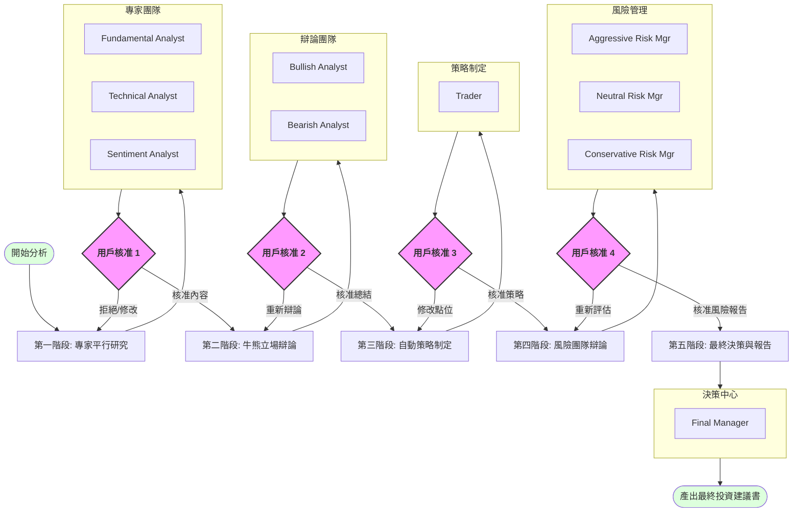

# Multi-Agent Trading Analysis (HITL Workflow)

## 專案概述
本專案是一個基於 Claude Code 的專業級股票分析系統，採用多代理人協作架構（Multi-Agent System）與全面的人類審核機制（Human-in-the-Loop, HITL）。系統模擬專業投資機構的運作流程，從數據獲取、專家研究、牛熊辯論到多維度風險管理，最終產出專業的投資報告。

## 核心工作流 (The Flow)

本系統的核心特色在於 **「用戶主導的內容篩選與流程控制」**。每一個階段的輸出都必須經過用戶的審核與確認，確保最終決策完全符合用戶的邏輯與偏好。

### 1. 第一階段：專家研究 (Specialist Research)
*   **數據獲取**：自動調用 Yahoo Finance MCP 工具獲取財務、新聞及歷史股價。
*   **平行研究**：
    *   **Fundamental Analyst**：分析基本面與財務狀況。
    *   **Technical Analyst**：分析技術指標與價格走勢。
    *   **Sentiment Analyst**：分析市場情緒與新聞導向。
*   **用戶核准點**：用戶審閱三份報告，決定採納內容或要求針對特定部分重跑。

### 2. 第二階段：牛熊立場辯論 (Bull vs Bear Debate)
*   **受限環境**：`Bullish Analyst` 與 `Bearish Analyst` 僅能基於用戶第一階段核准的內容進行辯論。
*   **內容攻防**：建立多方與空方的最強證據鏈。
*   **用戶核准點**：用戶審閱辯論總結，篩選合理的攻防點，決定是否需要更多輪次的辯論。

### 3. 第三階段：自動策略制定 (Strategy Formulation)
*   **Trader 介入**：根據核准的研究與辯論內容，自動制定入場點 (Entry)、目標價 (Target) 與停損點 (Stop-Loss)。
*   **用戶核准點**：用戶審核策略建議，確保執行邏輯符合預期。

### 4. 第四階段：風險管理團隊辯論 (Risk Management Debate)
*   **三方視角**：
    *   **Aggressive Risk Manager**：積極型，追求利潤極大化。
    *   **Neutral Risk Manager**：中立型，追求風險回報平衡。
    *   **Conservative Risk Manager**：保守型，追求資本保值。
*   **分輪審核**：每一輪風險辯論後，用戶皆可審閱三方觀點，決定剔除不合理項目或要求繼續辯論。

### 5. 第五階段：最終決策與報告 (Final Decision & Synthesis)
*   **自動決策**：`Final Manager` 整合所有「經用戶核准」的歷史紀錄，自動做出 `EXECUTION` 或 `REJECT` 的最終判斷。
*   **報告產出**：生成一份結構嚴密、完全基於核准內容的繁體中文投資建議書。

## 全面核准模式 (Universal Approval Pattern)

在工作流的每一個節點，用戶皆擁有以下控制權：
1.  **接受 (Accept)**：內容無誤，進入下一個階段。
2.  **篩選 (Include/Exclude)**：指定特定的論點或數據進行保留或剔除。
3.  **重新構思 (Rethink/Re-run)**：要求代理人根據修正後的指示重新進行分析或辯論。

## 代理人角色一覽

| 代理人名稱 | 核心職責 |
| :--- | :--- |
| **Fundamental Analyst** | 財務報表分析、估值評估、業務增長潛力。 |
| **Technical Analyst** | 趨勢分析、支撐/壓力位判定、技術形態識別。 |
| **Sentiment Analyst** | 新聞解讀、市場恐慌/貪婪程度分析、社交輿論導向。 |
| **Bullish Analyst** | 構建最強看多邏輯，尋找增長催化劑。 |
| **Bearish Analyst** | 構建最強看空邏輯，識別潛在風險因素。 |
| **Trader** | 將核准的研究轉化為具體的交易入場與出場計劃。 |
| **Aggressive Risk Mgr** | 評估機會成本與獲利動能。 |
| **Neutral Risk Mgr** | 評估勝率與風險回報比。 |
| **Conservative Risk Mgr** | 評估資本回撤與安全邊際。 |
| **Final Manager** | 流程監督者，負責產出最終決策報告。 |

## 使用方式
1.  啟動 `multi-agent-trading-analysis` 技能。
2.  輸入目標股票代碼（Ticker）。
3.  跟隨提示，在每個階段進行內容審核。

---
🤖 Generated with [Claude Code](https://claude.com)
