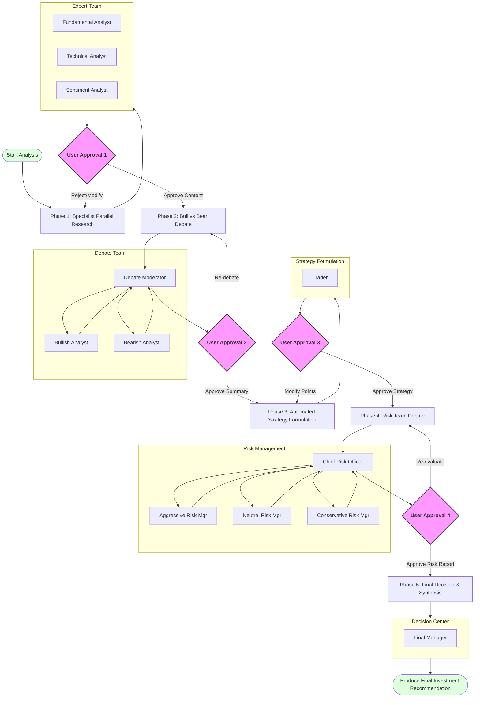

# Multi-Agent Trading Analysis (HITL Workflow)

[English](README.md) | [繁體中文](README.zh-TW.md)

## Project Overview
This project is a professional-grade stock analysis system based on Claude Code, featuring a Multi-Agent System (MAS) architecture with a comprehensive Human-in-the-Loop (HITL) mechanism. The system simulates the operational workflow of a professional investment firm, from data acquisition and specialist research to bull/bear debates and multi-dimensional risk management, culminating in a professional investment report.

## The Flow (Core Workflow)

The core feature of this system is **"User-led Content Filtering and Process Control."** Outputs from every stage must be reviewed and confirmed by the user, ensuring the final decision aligns perfectly with the user's logic and preferences.



## Team Configuration

| Team Name | Team Lead | Members |
| :--- | :--- | :--- |
| `debate-team` | `debate-moderator` | `bullish-analyst`, `bearish-analyst`, `debate-moderator` |
| `risk-manager-team` | `chief-risk-officer` | `aggressive-risk-manager`, `neutral-risk-manager`, `conservative-risk-manager`, `chief-risk-officer` |

### 1. Phase 1: Specialist Research
*   **Data Acquisition**: Automatically calls Yahoo Finance MCP tools to fetch financials, news, and price history.
*   **Parallel Research**:
    *   **Fundamental Analyst**: Analyzes fundamentals and financial health.
    *   **Technical Analyst**: Analyzes technical indicators and price action.
    *   **Sentiment Analyst**: Analyzes market sentiment and news direction.
*   **User Approval Point**: User reviews the three reports, decides which content to adopt, or requests re-runs for specific parts.

### 2. Phase 2: Bull vs Bear Debate
*   **Team Coordination**: The `Debate Moderator` orchestrates the `debate-team` and presents a "Conflict Map".
*   **Constrained Environment**: `Bullish Analyst` and `Bearish Analyst` can only debate based on content approved by the user in Phase 1.
*   **Content Offense/Defense**: Builds the strongest chains of evidence for both long and short positions.
*   **User Approval Point**: User reviews the moderator's Conflict Map via `AskUserQuestion`, filters valid points, and decides if further debate rounds are needed.

### 3. Phase 3: Automated Strategy Formulation
*   **Trader Intervention**: Automatically formulates Entry points, Targets, and Stop-Losses based on approved research and debate content.
*   **User Approval Point**: User reviews the strategy recommendations to ensure the execution logic meets expectations.

### 4. Phase 4: Risk Management Team Debate
*   **Team Coordination**: The `Chief Risk Officer (CRO)` manages a multi-round debate among specialists.
*   **Three Perspectives**:
    *   **Aggressive Risk Manager**: Seeks profit maximization and momentum.
    *   **Neutral Risk Manager**: Seeks risk-reward balance and win probability.
    *   **Conservative Risk Manager**: Seeks capital preservation and margin of safety.
*   **Round-based Review**: After each round of risk debate, the user reviews the CRO's synthesis, decides to exclude unreasonable items, or requests further debate.

### 5. Phase 5: Final Decision & Synthesis
*   **Automated Decision**: `Final Manager` integrates all "user-approved" historical records to automatically make a final `EXECUTION` or `REJECT` judgment.
*   **Report Generation**: Produces a tightly structured professional investment proposal, strictly based on approved content.

## Universal Approval Pattern

At every node of the workflow, the user holds the following controls:
1.  **Accept**: Content is correct, proceed to the next stage.
2.  **Filter (Include/Exclude)**: Specify particular arguments or data to keep or discard.
3.  **Rethink/Re-run**: Request agents to re-analyze or re-debate based on revised instructions.

## Agent Roles at a Glance

| Agent Name | Core Responsibility |
| :--- | :--- |
| **Fundamental Analyst** | Financial statement analysis, valuation, growth potential. |
| **Technical Analyst** | Trend analysis, support/resistance, technical patterns. |
| **Sentiment Analyst** | News interpretation, fear/greed analysis, social sentiment. |
| **Debate Moderator** | Orchestrates debates and maps core conflicts. |
| **Bullish Analyst** | Constructs the strongest bullish logic and catalysts. |
| **Bearish Analyst** | Constructs the strongest bearish logic and risk factors. |
| **Trader** | Translates approved research into concrete entry/exit plans. |
| **Chief Risk Officer** | Orchestrates risk assessment and multi-round synthesis. |
| **Aggressive Risk Mgr** | Evaluates opportunity cost and profit momentum. |
| **Neutral Risk Mgr** | Evaluates win rates and risk-reward ratios. |
| **Conservative Risk Mgr** | Evaluates drawdowns and margin of safety. |
| **Final Manager** | Responsible for executive reporting and final verdict based on user-approved history. |

## Usage
1.  **Enable Experimental Features**: To support parallel agent teams, you must enable the experimental setting in Claude Code:
    ```bash
    export CLAUDE_CODE_EXPERIMENTAL_AGENT_TEAMS=true
    ```
2.  Start the `multi-agent-trading-analysis` skill.
2.  Enter the target stock Ticker.
3.  Follow prompts to perform content review at each stage.

---
🤖 Generated with [Claude Code](https://claude.com)
