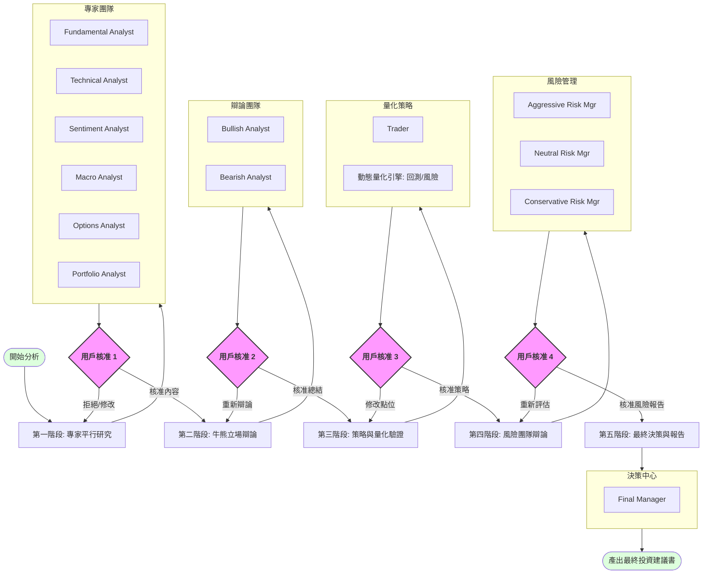

# Multi-Agent Trading Analysis (HITL Workflow)

[English](README.md) | [繁體中文](README.zh-TW.md)

## 專案概述
本專案是一個基於 Claude Code 的專業級股票分析系統，採用多代理人協作架構（Multi-Agent System）與全面的人類審核機制（Human-in-the-Loop, HITL）。系統採用 **「零代碼驅動 (Zero-Code Driven)」** 架構，所有量化邏輯均由代理人動態執行，無需預寫腳本。系統模擬專業投資機構的運作流程，從多標的投資組合研究、專家分析、牛熊辯論到進階風險引擎模擬（VaR/蒙地卡羅），最終產出專業的投資報告。

## 核心工作流 (The Flow)

本系統的核心特色在於 **「用戶主導的內容篩選與流程控制」**。每一個階段的輸出都必須經過用戶的審核與確認。

### 1. 第一階段：專家研究 (Specialist Research)
*   **數據獲取**：自動調用 Yahoo Finance MCP 工具獲取財務、新聞、歷史股價及期權鏈數據。
*   **平行研究**：
    *   **Fundamental Analyst**：分析基本面與財務狀況。
    *   **Technical Analyst**：分析技術指標與價格走勢。
    *   **Sentiment Analyst**：分析市場情緒與新聞導向。
    *   **Macro Analyst**：全球宏觀經濟背景分析。
    *   **Options Analyst**：隱含波動率與市場預期分析。
    *   **Portfolio Analyst**：資產相關性與權重優化建議。
*   **用戶核准點**：用戶審閱六份報告，決定採納內容。

### 2. 第二階段：牛熊立場辯論 (Bull vs Bear Debate)
*   **受限環境**：代理人僅能基於用戶第一階段核准的內容進行攻防。
*   **用戶核准點**：用戶篩選合理的攻防點，決定是否需要更多輪次。

### 3. 第三階段：策略與量化驗證 (Zero-Code)
*   **Trader 制定**：制定包含進場/目標/停損的具體計畫。
*   **動態量化引擎**：即時執行：
    *   **真實回測**：包含滑價與手續費的歷史表現。
    *   **風險引擎**：99% VaR/CVaR 壓力測試及 10,000 次蒙地卡羅路徑模擬。
*   **用戶核准點**：用戶結合量化驗證數據審核交易策略。

### 4. 第四階段：風險管理團隊辯論 (Risk Management Debate)
*   **數據仲裁**：ARM, NRM, 與 CRM 基於量化風險數據（VaR, PoP）進行多視角評估。
*   **用戶核准點**：用戶審閱經風險調整後的投資建議。

### 5. 第五階段：最終決策與報告 (Final Decision & Synthesis)
*   **自動決策**：`Final Manager` 整合所有核准紀錄做出判斷。
*   **報告產出**：生成專業的《最終投資決策書 (Final Investment Memorandum)》。

## 零代碼架構 (Zero-Code Architecture)
本專案**不保留任何永久性 Python 腳本檔案**。所有邏輯皆定義於 Markdown 代理人與技能中。計算任務由代理人利用底層環境即時編寫並執行腳本完成，確保純粹的提示詞驅動體驗。

## 代理人角色一覽

| 代理人名稱 | 核心職責 |
| :--- | :--- |
| **Fundamental Analyst** | 財務報表與估值分析。 |
| **Technical Analyst** | 趨勢與支撐壓力判定。 |
| **Sentiment Analyst** | 市場敘事與新聞解讀。 |
| **Macro Analyst** | 利率與宏觀催化劑。 |
| **Options Analyst** | 隱含波動率、偏斜與期權牆。 |
| **Portfolio Analyst** | 相關性研究與權重優化。 |
| **Bullish Analyst** | 看多邏輯與催化劑。 |
| **Bearish Analyst** | 看空邏輯與風險因素。 |
| **Trader** | 具體交易執行計畫。 |
| **Aggressive Risk Mgr** | 機會成本與獲利動能。 |
| **Neutral Risk Mgr** | 勝率與風險回報比。 |
| **Conservative Risk Mgr** | 回撤控管與 VaR 限制。 |
| **Final Manager** | CIO 角色，負責最終決策。 |

---
🤖 Generated with [Claude Code](https://claude.com)
